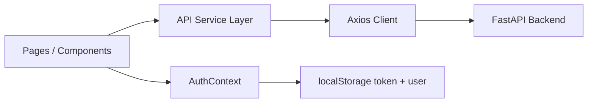

# shop-fe

ShopApp storefront frontend for browsing products, managing cart items, placing orders, updating profile data, and administering catalog users through a FastAPI backend.

## Overview

This frontend is a Vite + React application that provides a customer-facing shopping experience and an admin dashboard. It authenticates users with JWT-like bearer tokens stored in `localStorage`, protects private routes, and communicates with the backend through a centralized Axios client.

The client is configured in `src/services/api.js` and defaults to the backend at `VITE_API_URL` or `/api`. API routes cover auth (`/users`), products (`/products`), categories (`/categories`), cart (`/cart`), and orders (`/orders`).

## Features

- Product catalog with search and category filtering
- Add-to-cart flow with quantity selection
- Cart review and checkout order creation
- Order history page for signed-in users
- User profile management with avatar upload and password change
- Admin dashboard for product CRUD, category CRUD, and user management
- Route protection for authenticated and admin-only pages
- Toast notifications for user feedback
- Responsive layout built with Tailwind CSS

## Tech Stack

| Category | Stack |
| --- | --- |
| Language | JavaScript (ES modules) |
| UI framework | React 18 |
| Build tool | Vite 5 |
| Routing | React Router DOM 6 |
| HTTP client | Axios |
| Styling | Tailwind CSS 3 |
| Notifications | react-hot-toast |
| Icons | lucide-react |
| State management | React Context API |

## Architecture

The frontend follows a simple page-to-service flow:

- Pages render UI and call API helpers from the service layer.
- `AuthContext` manages global auth state and token persistence.
- Protected routes check the current user and role before rendering.
- The Axios client attaches bearer tokens on every request and redirects to `/login` on `401` responses.



## Project Structure

```text
shop-fe/
├── Dockerfile
├── index.html
├── nginx.conf
├── netlify.toml
├── package.json
├── postcss.config.js
├── tailwind.config.js
├── vite.config.js
├── public/
│   └── _redirects
├── src/
│   ├── App.jsx
│   ├── index.css
│   ├── main.jsx
│   ├── components/
│   │   ├── common/
│   │   │   └── ProtectedRoute.jsx
│   │   └── layout/
│   │       └── Navbar.jsx
│   ├── context/
│   │   └── AuthContext.jsx
│   ├── pages/
│   │   ├── admin/
│   │   │   └── AdminPage.jsx
│   │   ├── auth/
│   │   │   ├── LoginPage.jsx
│   │   │   ├── ProfilePage.jsx
│   │   │   └── RegisterPage.jsx
│   │   ├── cart/
│   │   │   └── CartPage.jsx
│   │   ├── orders/
│   │   │   └── OrdersPage.jsx
│   │   └── products/
│   │       └── ProductsPage.jsx
│   └── services/
│       └── api.js
└── README.md
```

### Folder responsibilities

- `src/pages`: route-level screens for auth, products, cart, orders, and admin.
- `src/components`: reusable UI elements such as the navbar and route guard.
- `src/context`: application-wide auth state through `AuthContext`.
- `src/services`: centralized backend API calls.
- `public`: static assets and Netlify redirect fallback. 
- `Dockerfile` / `nginx.conf`: production containerization and static site serving.

## Requirements

- Node.js 22 (the Docker build uses `node:22-alpine`)
- npm (package manager used in this project)
- Access to the backend API server at `VITE_API_URL`

## Installation

```bash
cd shop-fe
npm install
```

## Environment Variables

No `.env.example` file is checked into this frontend, but the app reads the following variable at runtime:

| Variable | Description | Example Value |
| --- | --- | --- |
| `VITE_API_URL` | Base URL for the FastAPI backend used by Axios | `http://localhost:8000` |

If this value is not set, the client falls back to `/api`.

## Running Frontend

Start the development server:

```bash
cd shop-fe
npm run dev
```

This runs Vite in development mode, typically exposing the app on `http://localhost:5173`.

## API Integration

The API client is defined in `src/services/api.js` and includes these groups:

- `authAPI`: `register`, `login`, `getMe`, `updateMe`, `updateAvatar`, `changePassword`
- `productAPI`: `getAll`, `create`, `update`, `delete`
- `categoryAPI`: `getAll`, `create`, `update`, `delete`
- `cartAPI`: `get`, `add`, `removeItem`
- `orderAPI`: `create`, `getMyOrders`
- `adminAPI`: `getAllUsers`, `deleteUser`

Behavior:

- Axios is created with `baseURL = import.meta.env.VITE_API_URL || "/api"`
- A request interceptor reads `localStorage.getItem("token")` and sets the `Authorization: Bearer <token>` header
- If the request body is a `FormData` object, it removes the default JSON content type
- A response interceptor clears the auth state and redirects to `/login` when the API returns `401`

## Authentication

Authentication is handled through `AuthContext` in `src/context/AuthContext.jsx`.

- On app startup, the app checks `localStorage.getItem("token")` and `localStorage.getItem("user")`
- `login()` posts credentials to `/users/login`, stores the JWT token, fetches the current user, and stores the user object
- `logout()` removes the token and user from storage and resets auth state
- `refreshUser()` re-fetches the current user profile after profile or avatar updates
- Protected routes reject unauthenticated users and non-admin users as needed

Login and registration pages are under `src/pages/auth`.

## Routing

The application route configuration is defined in `src/App.jsx`.

| Path | Component | Access |
| --- | --- | --- |
| `/login` | `LoginPage` | Public |
| `/register` | `RegisterPage` | Public |
| `/` | `ProductsPage` | Authenticated users |
| `/cart` | `CartPage` | Authenticated users |
| `/orders` | `OrdersPage` | Authenticated users |
| `/profile` | `ProfilePage` | Authenticated users |
| `/admin` | `AdminPage` | Admin only |
| `*` | `Navigate to /` | Redirect |

`ProtectedRoute` checks the current user and blocks access if not logged in or if `adminOnly` is required.

## Components

Main reusable or page-level UI pieces include:

- `Navbar`: top navigation bar with product, cart, orders, and admin links, plus logout/login controls
- `ProtectedRoute`: route guard for auth and admin-only access
- `LoginPage`: email/password sign-in form
- `RegisterPage`: user registration form
- `ProfilePage`: profile editing, password update, and avatar upload
- `ProductsPage`: catalog grid, filters, quantity controls, and add-to-cart actions
- `CartPage`: cart listing, total calculation, and order placement
- `OrdersPage`: collapsible order history list
- `AdminPage`: tabbed admin dashboard for products, categories, and users

## State Management

This project does not use Redux, Zustand, or a separate store library. Global auth state is managed via a React Context pattern:

- `AuthContext` exposes `user`, `loading`, `login`, `logout`, and `refreshUser`
- `AuthProvider` wraps the app in `src/App.jsx`
- Components access user and auth functions via `useAuth()`

## Styling / UI

The UI uses:

- Tailwind CSS for layout and utility classes
- `@layer` component utilities in `src/index.css` such as `.btn-primary`, `.btn-secondary`, `.input-field`, and `.card`
- `lucide-react` for icons
- `react-hot-toast` for ephemeral notifications
- Responsive card-based layouts for desktop and mobile screens

This is a utility-first styling approach rather than CSS modules or a component library.

## Build

Create a production build:

```bash
cd shop-fe
npm run build
```

This generates the production bundle in the `dist/` directory.

## Deployment

The project includes two deployment-ready patterns:

### Docker / Nginx

```bash
cd shop-fe
docker build -t shop-fe .
docker run -p 80:80 shop-fe
```

The `Dockerfile` builds the Vite app and serves the static output with Nginx.

### Netlify

The repository includes a `netlify.toml` file with a wildcard redirect:

```toml
[[redirects]]
from = "/*"
to = "/index.html"
status = 200
```

This ensures client-side routes still resolve correctly on Netlify static hosting.

## License

No license file was found in this frontend project directory. The backend repository includes a license, but the frontend folder itself does not declare one.
